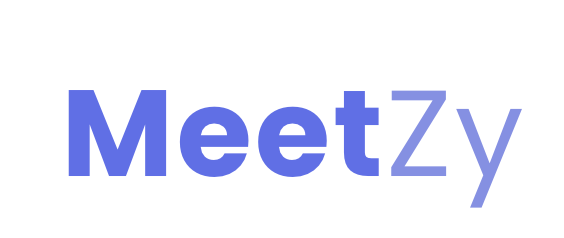

<!--

*** Thanks for checking out the Best-README-Template. If you have a suggestion

*** that would make this better, please fork the repo and create a pull request

*** or simply open an issue with the tag "enhancement".

*** Don't forget to give the project a star!

*** Thanks again! Now go create something AMAZING! :D

-->

<!-- PROJECT SHIELDS -->

<!--

*** I'm using markdown "reference style" links for readability.

*** Reference links are enclosed in brackets [ ] instead of parentheses ( ).

*** See the bottom of this document for the declaration of the reference variables

*** for contributors-url, forks-url, etc. This is an optional, concise syntax you may use.

*** https://www.markdownguide.org/basic-syntax/#reference-style-links

-->

 
</a>

<h3  align="center">Meetzy</h3>

App to manage Events

 
 

Check out the demo of the Meetzy app [here](https://drive.google.com/file/d/1jHR3rTmfyed2Ie5Lvny4haP0cRge9nzV/view?usp=sharing).

</ol>

### Built With

[![Flutter][Flutter.dev]][Flutter-url]  

Tech Used : Hive, Riverpod, Dio and a bit of testing.

(<a  href="#readme-top">back to top</a>)

<!-- FEATURES -->

<!-- https://www.markdownguide.org/basic-syntax/#reference-style-links -->

[Flutter.dev]: https://img.shields.io/badge/Flutter-20232A?style=for-the-badge&logo=flutter&logoColor=61DAFB
[Flutter-url]: https://flutter.dev/
[Riverpod.dev]: https://img.shields.io/badge/Riverpod-20232A?style=for-the-badge&logo=riverpod&logoColor=61DAFB
[Riverpod-url]: https://riverpod.dev/
[Express-badge]: https://img.shields.io/badge/Express.js-20232A?style=for-the-badge&logo=express&logoColor=5CA74B
[Express-url]: https://expressjs.com/
[Prisma-badge]: https://img.shields.io/badge/Prisma-20232A?style=for-the-badge&logo=prisma&logoColor=ffffff
[Prisma-url]: https://www.prisma.io/
